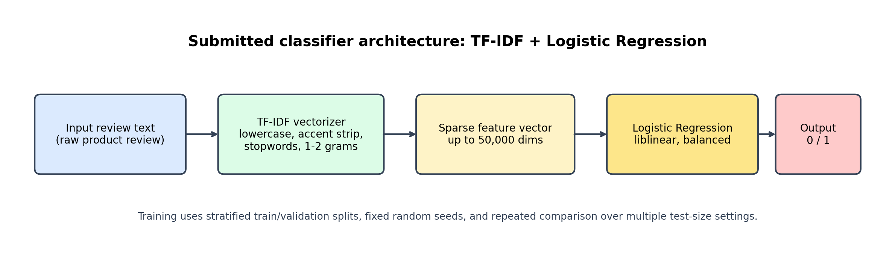

# EE6483 Artificial Intelligence and Data Mining Mini Project Report

Sentiments of Product Reviews

Prepared on 5 April 2026

Group members: [Please fill in before submission]

- Name / matriculation number / contribution

- Name / matriculation number / contribution

- Name / matriculation number / contribution

Executive summary. This project addresses binary document-level sentiment classification on 7,401 product reviews with a hidden test set of 1,851 reviews. The training data is strongly imbalanced (1,082 negative vs 6,319 positive, or 14.62% vs 85.38%). A reproducible 27-run comparison over three classical models, three holdout sizes (20%, 30%, 40%), and three random seeds (42, 52, 62) found that TF-IDF with Logistic Regression is the best submission model. Its best aggregate setting achieved mean accuracy 0.9219 and mean macro-F1 0.8461 at 20% holdout. The final submission was generated by retraining this model on all labeled data and writing predictions for all 1,851 hidden test reviews.

## 1. Problem Statement and Dataset

The task is binary sentiment classification of product reviews. Each training example contains raw review text and a gold label where 0 denotes negative sentiment and 1 denotes positive sentiment. The hidden test set contains only review text. In this project, the main goal is to design a learning-based classifier, compare alternatives fairly, generate submission.csv for the test set, and justify the selected approach with reference to the literature and to empirical evidence from the dataset.

- Training set size: 7,401 reviews

- Hidden test set size: 1,851 reviews

- Label distribution in training set: 1,082 negative (14.62%) and 6,319 positive (85.38%)

- Primary validation metrics: accuracy and macro-F1, with macro-F1 emphasized because of class imbalance

## 2. Literature Survey

### 2.1 Problem definitions, settings, challenges, and common solution types

Sentiment analysis, also called opinion mining, studies how to infer attitudes, evaluations, and polarity from text [1]. For product reviews, the most common formulation is document-level polarity classification, where the label space is closed and usually binary or ternary. However, the broader field also includes sentence-level sentiment, aspect-based sentiment analysis, comparative opinion mining, and subjective text understanding [1], [11], [12].

- Supervised setting: labeled reviews are available; typical methods include TF-IDF plus linear classifiers, CNN/RNN models, and transformer fine-tuning.

- Unsupervised or weakly supervised setting: labels are absent or scarce; lexicon methods and semantic-orientation methods such as Turney's PMI-based approach are classic options [3].

- Closed-set setting: the label space is fixed, e.g. positive vs negative. This is the setting used in this project.

- Open-set or out-of-distribution setting: reviews may contain unseen sentiment categories, mixed opinions, sarcasm, spam, or off-topic content; practical systems then need calibration, abstention, or out-of-domain detection.

- With domain shift: train and test domains differ, for example electronics reviews versus hotel reviews; domain adaptation becomes central because sentiment expressions and targets change by domain [4], [8], [13].

- Without domain shift: train and test are matched; simpler lexical baselines often remain very competitive, especially on review data with explicit sentiment words [2].

Across these settings, the main challenges are negation, mixed sentiment in a single review, aspect-specific polarity, sarcasm or pragmatics, label imbalance, domain shift, annotation noise, and the mismatch between product quality sentiment and service or shipping sentiment [1], [4], [11]. These challenges explain why simple bag-of-words features can still be strong on clean in-domain data, while domain-adaptive or sentiment-aware pretrained models are often preferred when the task is more complex or cross-domain.

### 2.2 Rapid review of influential and recent literature

A focused review of foundational papers and recent work from ACL, EMNLP, NAACL, and LREC-COLING shows a clear progression in the field. Early work established that supervised machine learning on n-gram features is highly effective for review sentiment classification [2], while Turney showed that unsupervised semantic orientation can work surprisingly well even without labels [3]. Blitzer et al. then demonstrated that domain adaptation is a fundamental problem in sentiment classification because lexical cues do not transfer perfectly across product domains [4].

- Pretrained language models changed the field. BERT introduced bidirectional transformer pretraining [5], RoBERTa showed that stronger pretraining choices can materially improve downstream results [6], and DeBERTa further improved representation quality through disentangled attention and enhanced decoding [7].

- Adaptive pretraining became a major practical direction. Gururangan et al. showed that domain-adaptive and task-adaptive pretraining can produce consistent gains, including on review tasks [8].

- Sentiment-specific pretraining emerged as a specialized improvement path. SKEP injects sentiment words and aspect-sentiment knowledge into pretraining [9], while SentiLARE integrates polarity and linguistic knowledge [10].

- Recent critique and benchmarking work adds nuance. Venkit et al. argue that sentiment itself is often under-defined and socially contextualized [11]. Zhang et al. show that large language models are promising in few-shot settings but are not automatically superior on all sentiment tasks, especially structured or subtle ones [12].

- Domain adaptation remains an active topic. Li et al. present efficient adaptive tuning for multi-source sentiment analysis, reflecting the continued importance of cross-domain robustness in 2024 [13].

### 2.3 Recent progress and selected in-depth papers

Two representative high-performing research directions stand out from the literature. The first is the Microsoft Research line of strong general-purpose pretrained encoders, exemplified by DeBERTa [7]. The second is the sentiment-specialized pretraining line, exemplified by Baidu's SKEP [9]. These directions are complementary: DeBERTa provides a strong generic backbone, while SKEP injects task-specific sentiment knowledge directly into pretraining.

#### Selected work 1: DeBERTa (Microsoft Research)

DeBERTa separates content and positional information in attention and adds an enhanced mask decoder [7]. This matters for sentiment classification because polarity often depends on subtle word interactions such as contrast, negation, and scope. Compared with earlier BERT-style models, DeBERTa reports stronger efficiency and stronger downstream NLU results. For a product-review task like this one, DeBERTa is attractive when computational budget allows fine-tuning because it offers stronger contextual understanding than sparse lexical models.

#### Selected work 2: SKEP (Baidu / PaddleNLP line)

SKEP is particularly relevant to sentiment analysis because it explicitly injects sentiment knowledge into pretraining [9]. Instead of treating sentiment as an ordinary downstream label only, it incorporates sentiment masking and prediction objectives so that polarity and aspect interactions are encoded earlier in the model. This is attractive for review analysis because many reviews express sentiment through sentiment-bearing words, aspect-target pairs, and local compositional patterns. In practice, SKEP represents a strong upgrade path over generic BERT-style fine-tuning when the task is clearly sentiment-centric.

### 2.4 Suitable baseline and improvement path for this project

For the present project, TF-IDF with Logistic Regression is a suitable baseline and, based on the experiments, also the best submission model. The reason is practical as well as empirical. Product reviews often contain explicit lexical polarity cues, the dataset is moderate in size, the label space is simple and closed, and the project emphasizes reproducibility. Under these conditions, a linear classifier on TF-IDF features offers an excellent balance of accuracy, interpretability, runtime, and stability. In the 27-run benchmark, it achieved the highest mean macro-F1 among the models available in this environment.

- Replace the sparse encoder with a pretrained transformer such as DeBERTa for stronger contextual modeling [7].

- Use domain-adaptive pretraining on unlabeled review data before supervised fine-tuning [8].

- Use a sentiment-aware encoder such as SKEP or SentiLARE if compute and dependencies are available [9], [10].

- Add better handling of label noise, ambiguous reviews, and out-of-domain samples through calibration, confidence-based filtering, and semi-supervised self-training [11], [12].

## 3. Feature Format and Data Preprocessing

The submitted system uses TF-IDF features over word unigrams and bigrams. This format was chosen because it is fast, sparse, reproducible, and well suited to product reviews where sentiment is often expressed by explicit phrases such as "very comfortable", "cheap and flimsy", or "am returning". It also aligns closely with the classical literature on review classification [2].

- Load the JSON records and keep the review text and sentiment columns only.

- Drop rows with missing review text or missing labels.

- Cast the review column to string and the label column to integer.

- Validate that the labels are only 0 or 1.

- Within the TF-IDF vectorizer, lowercase the text, strip Unicode accents, remove English stopwords, and construct word 1-gram and 2-gram features.

- Discard extremely rare features with min_df = 2, cap the feature space at 50,000 terms, and use sublinear term frequency scaling.

The resulting feature matrix is sparse and document-level. For N reviews, the input to the classifier has shape N x V, where V is at most 50,000 after vocabulary truncation.

## 4. Classifier Design, Architecture, and Training Strategy

The final classifier is TF-IDF followed by Logistic Regression. Conceptually, the pipeline first converts each review into a sparse weighted bag of unigrams and bigrams, then applies a linear classifier that predicts the probability of positive versus negative sentiment. Since the label space is binary, the model outputs one of two classes: 0 (negative) or 1 (positive).

- Input: raw review text of variable length.

- Feature encoder: TF-IDF sparse vector with up to 50,000 dimensions.

- Classifier: Logistic Regression with class_weight = balanced.

- Output dimension: 2 classes (negative / positive).

- Loss function: logistic loss, optimized by the liblinear solver.

The training strategy emphasizes reproducibility. All model comparisons use stratified train/validation splits so that both classes remain represented in each split. To reduce the risk of reporting a lucky or unlucky single split, experiments were repeated across three random seeds (42, 52, 62) and three validation holdout sizes (20%, 30%, 40%). This produced 27 classical benchmark runs in total.

The repository code used for the final pipeline is centered in src/sentiment_project/core.py, with training and comparison entry points in scripts/train_classical_models.py, scripts/generate_comparison_report.py, and scripts/train_full_classical_submission.py. The main commands used are shown below.

- Benchmark all available classical models: python scripts/train_classical_models.py --model-names all --test-sizes 0.2 0.3 0.4 --seeds 42 52 62

- Generate aggregate comparison tables and confusion matrices: python scripts/generate_comparison_report.py

- Train the final submission model on all labeled data: python scripts/train_full_classical_submission.py --model-name tfidf_logreg

### 4.1 Benchmark comparison results

Table 1 summarizes the aggregate results over repeated seeds. The best overall setting was tfidf_logreg at 20% holdout, with mean accuracy 0.9219 and mean macro-F1 0.8461. Macro-F1 is more important than raw accuracy here because the dataset is highly imbalanced toward positive reviews.

| Model        | Holdout   |   Mean Accuracy |   Mean Macro-F1 |   Runs |
|:-------------|:----------|----------------:|----------------:|-------:|
| tfidf_logreg | 20%       |          0.9219 |          0.8461 |      3 |
| tfidf_svm    | 20%       |          0.9251 |          0.8391 |      3 |
| tfidf_logreg | 30%       |          0.9176 |          0.8354 |      3 |
| tfidf_logreg | 40%       |          0.9141 |          0.8273 |      3 |
| tfidf_svm    | 30%       |          0.9184 |          0.8213 |      3 |
| tfidf_svm    | 40%       |          0.9152 |          0.8134 |      3 |
| tfidf_nb     | 20%       |          0.8911 |          0.6854 |      3 |
| tfidf_nb     | 30%       |          0.8886 |          0.6721 |      3 |
| tfidf_nb     | 40%       |          0.8856 |          0.6592 |      3 |

## 5. Parameter Selection and Rationale

The parameters were selected to balance accuracy, robustness, and runtime. The same choices are reflected in the final code. A small manual search in the notebook and the repeated benchmark both supported the final configuration.

- ngram_range = (1, 2): unigram features capture words such as "great" and "terrible", while bigrams capture short phrases such as "very comfortable" or "not worth".

- max_features = 50,000: large enough to retain useful review vocabulary, but small enough to keep training fast and memory reasonable.

- min_df = 2: removes singleton features that are likely to be noise.

- regularization C = 4.0: chosen because it performed strongly in the TF-IDF notebook search and remained stable in repeated runs.

- class_weight = balanced: necessary because the negative class is only 14.62% of the training set.

- max_iter = 2000 and solver = liblinear: stable optimization for sparse linear classification.

- Holdout sizes 20%, 30%, and 40% were compared explicitly. The 20% holdout performed best overall because it preserved more training data while keeping validation large enough to be informative.

## 6. Application to the Hidden Test Set and Submission File

After model selection, the final TF-IDF + Logistic Regression system was retrained on all 7,401 labeled training reviews and applied to the 1,851 hidden test reviews. The resulting submission file is data/submissions/submission.csv. Since the hidden test labels are not provided, only the prediction file and label distribution can be reported here; true test accuracy cannot be computed locally.

| Statistic           |   Value |
|:--------------------|--------:|
| Training reviews    |    7401 |
| Test reviews        |    1851 |
| Train negatives     |    1082 |
| Train positives     |    6319 |
| Predicted negatives |     295 |
| Predicted positives |    1556 |

## 7. Analysis of Correct and Incorrect Predictions

The assignment asks for analysis of correct and incorrect predictions on the test set. However, the hidden test labels are unavailable, so this section analyzes a held-out validation split instead. The examples below come from the best validation configuration: TF-IDF + Logistic Regression, 20% holdout, seed 42. This avoids test leakage while still giving a meaningful view of model behavior.

- Correct positive example: "Very happy with these, they're very comfortable - and TWO colors each. Pleased with transaction." This is classified correctly because the review contains several direct positive cues such as "very happy", "comfortable", and "pleased". The model is strong when polarity is explicit and lexically consistent.

- Correct negative example: "So cheap, the seams weren't sewn up all the way. Am returning." This is also classified correctly because defect-oriented words such as "cheap", "weren't sewn", and "returning" are highly informative in TF-IDF space.

- Incorrect case 1: "This camisole did not fit my purpose. The idea is great, but it didn't fit me correctly." The model predicted positive. This shows a weakness on mixed reviews where a short positive phrase ("idea is great") competes with the true negative outcome.

- Incorrect case 2: "When I ordered the item ... it arrived well after date needed ..." The gold label is positive, but the model predicted negative. This is an informative failure because the text is negative about shipping even if the annotation may reflect the overall item or customer experience differently. This suggests some label ambiguity or mismatch between product sentiment and service sentiment.

- Overall strength: the model is efficient and reliable on explicit polarity words and common defect or satisfaction phrases.

- Overall weakness: the model can struggle on nuanced compositional cases, mixed sentiment, and examples where shipping or sizing complaints interact with an otherwise positive label.

The best single validation run achieved accuracy 0.9251, macro-F1 0.8499, and confusion matrix TN=161, FP=56, FN=55, TP=1209. These numbers indicate that the positive class is modeled very well, but negative reviews remain harder because they are both fewer and more diverse.

## 8. Effect of Feature Format on Resource Consumption and Accuracy

Different feature formats change both the computational profile and the expected performance ceiling of the project. Table 2 summarizes the main trade-offs.

| Feature format                   | Training cost   | Inference cost   | Expected behavior                                                                               |
|:---------------------------------|:----------------|:-----------------|:------------------------------------------------------------------------------------------------|
| TF-IDF n-grams                   | Low             | Low to moderate  | Strong on explicit sentiment words and short reviews; weak on deeper semantics and domain shift |
| Static embeddings + CNN/RNN      | Medium          | Medium           | Captures order and local context better than TF-IDF; needs more tuning and compute              |
| Pretrained transformers          | High            | High             | Usually highest ceiling and transfer ability; most expensive to fine-tune and deploy            |
| Large language models (few-shot) | Very high       | Very high        | Useful when labels are scarce, but costly and not always best on structured sentiment tasks     |

For this project, TF-IDF is the best practical choice because it trains in seconds, is easy to reproduce, and already performs strongly on product reviews. Word-embedding sequence models and transformer models are more attractive when richer context modeling or domain transfer becomes the priority. The literature suggests that the next major accuracy gains would likely come from pretrained transformers or sentiment-aware pretraining rather than from increasingly complex classical models [7]-[10].

## 9. Transfer to Hotel Reviews Without Rating Scores

If the same classifier is applied to hotel reviews in a separate project where only raw text is available and rating scores are absent, the model would still have partial transfer value because many sentiment expressions are domain-general. Words such as "comfortable", "dirty", "friendly", or "terrible" still carry polarity. However, performance would likely drop because hotel reviews contain domain-specific aspects such as room cleanliness, check-in quality, breakfast, location, and staff behavior. This is a classic domain-shift problem [4], [8], [13].

- Expected behavior without modification: reasonable zero-shot transfer on clearly positive or negative reviews, but weaker performance on domain-specific phrases and aspect-heavy hotel language.

- Useful modification 1: collect and annotate a small hotel-review set, then fine-tune or refit the model on the target domain.

- Useful modification 2: perform domain-adaptive pretraining or self-training on large amounts of unlabeled hotel reviews before supervised tuning [8].

- Useful modification 3: enrich the model with hotel-specific lexicons or aspect-aware features such as room, staff, breakfast, noise, location, and cleanliness.

- Useful modification 4: move to a pretrained transformer if cross-domain generalization becomes more important than raw speed.

## 10. Hotel Review Scenario with Noisy Rating Labels

If hotel review rating scores are available but inaccurate, the current algorithm would suffer in two ways. First, it would learn from contradictory examples, which would reduce decision-boundary quality. Second, evaluation itself would become unreliable because some apparent errors would actually come from wrong labels rather than wrong predictions. This is especially harmful in sentiment classification because many reviews are already borderline or mixed.

- Approach 1: label-error detection and cleaning. Use confident learning, agreement-based filtering, or manual review of suspicious examples so that obvious label mistakes are corrected before training.

- Approach 2: noise-robust training. Use sample reweighting, bootstrap targets, generalized cross-entropy, or early stopping so the model does not overfit mislabeled cases.

- Approach 3: semi-supervised teacher-student retraining. Train on the cleaner subset first, then pseudo-label only high-confidence unlabeled or weakly labeled examples to expand the data more safely.

In practice, a combination of these three approaches is often strongest: clean the worst labels, train with a robust objective, and exploit high-confidence unlabeled data. This is especially attractive when large amounts of hotel text exist but the rating supervision is unreliable.

## 11. Conclusion

This project showed that a carefully tuned classical baseline remains highly competitive for binary product-review sentiment classification. Repeated experiments across seeds and validation sizes established that TF-IDF with Logistic Regression is the best available submission model in this environment, outperforming Linear SVM and Multinomial Naive Bayes in mean macro-F1. The final system is simple, fast, interpretable, and reproducible, while the literature clearly indicates a path toward stronger future systems through domain-adaptive and sentiment-aware transformer models. For this assignment, the chosen approach provides a strong balance between sound methodology, empirical performance, and practical feasibility.

## References

[1] Bing Liu. Sentiment Analysis and Opinion Mining. Morgan & Claypool, 2012. https://www.cs.uic.edu/~liub/FBS/SentimentAnalysis-and-OpinionMining-Survey-Book.pdf

[2] Bo Pang, Lillian Lee, and Shivakumar Vaithyanathan. Thumbs up? Sentiment Classification Using Machine Learning Techniques. EMNLP 2002. https://aclanthology.org/W02-1011/

[3] Peter D. Turney. Thumbs Up or Thumbs Down? Semantic Orientation Applied to Unsupervised Classification of Reviews. ACL 2002. https://arxiv.org/abs/cs/0212032

[4] John Blitzer, Mark Dredze, and Fernando Pereira. Biographies, Bollywood, Boom-boxes and Blenders: Domain Adaptation for Sentiment Classification. ACL 2007. https://aclanthology.org/P07-1056/

[5] Jacob Devlin, Ming-Wei Chang, Kenton Lee, and Kristina Toutanova. BERT: Pre-training of Deep Bidirectional Transformers for Language Understanding. NAACL 2019. https://arxiv.org/abs/1810.04805

[6] Yinhan Liu et al. RoBERTa: A Robustly Optimized BERT Pretraining Approach. arXiv 2019. https://arxiv.org/abs/1907.11692

[7] Pengcheng He, Xiaodong Liu, Jianfeng Gao, and Weizhu Chen. DeBERTa: Decoding-enhanced BERT with Disentangled Attention. ICLR 2021. https://openreview.net/forum?id=XPZIaotutsD

[8] Suchin Gururangan et al. Don't Stop Pretraining: Adapt Language Models to Domains and Tasks. ACL 2020. https://aclanthology.org/2020.acl-main.740/

[9] Hao Tian et al. SKEP: Sentiment Knowledge Enhanced Pre-training for Sentiment Analysis. ACL 2020. https://aclanthology.org/2020.acl-main.374/

[10] Pei Ke et al. SentiLARE: Sentiment-Aware Language Representation Learning with Linguistic Knowledge. EMNLP 2020. https://aclanthology.org/2020.emnlp-main.567/

[11] Pranav Venkit et al. The Sentiment Problem: A Critical Survey towards Deconstructing Sentiment Analysis. EMNLP 2023. https://aclanthology.org/2023.emnlp-main.848/

[12] Wenxuan Zhang et al. Sentiment Analysis in the Era of Large Language Models: A Reality Check. Findings of NAACL 2024. https://aclanthology.org/2024.findings-naacl.246/

[13] Rui Li et al. Feature Structure Matching for Multi-source Sentiment Analysis with Efficient Adaptive Tuning. LREC-COLING 2024. https://aclanthology.org/2024.lrec-main.628/

[14] Tomas Mikolov, Kai Chen, Greg Corrado, and Jeffrey Dean. Efficient Estimation of Word Representations in Vector Space. arXiv 2013. https://arxiv.org/abs/1301.3781

[15] Jeffrey Pennington, Richard Socher, and Christopher Manning. GloVe: Global Vectors for Word Representation. EMNLP 2014. https://nlp.stanford.edu/projects/glove/
